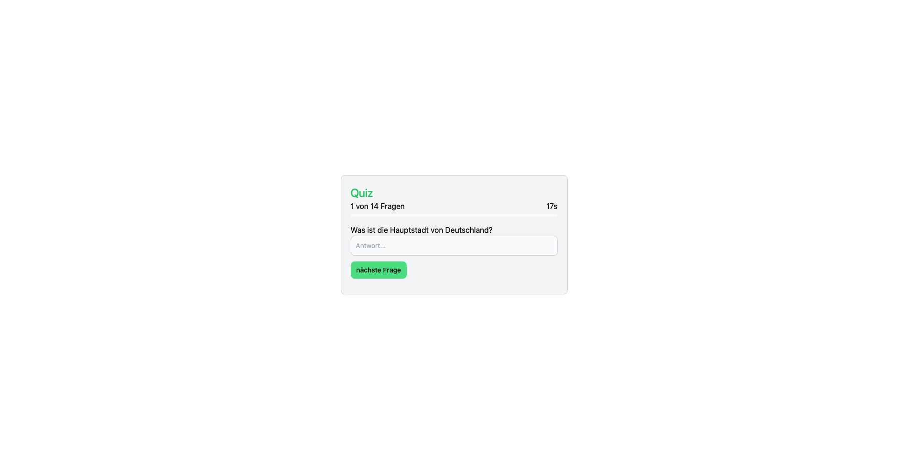

# 🎓 QuizMe - Interactive Quiz Website

QuizMe is a dynamic quiz website that utilizes JavaScript to fetch questions from a MySQL database and validate user answers

## 🖼️ Screenshots:

[more images](./.assets/screenshots.md)

## 🛠️ Technologies:
- MySQL stores quiz data
- JavaScript fetches/submit questions and validates answers
- Tailwind CSS for fast and simple styling

## 🚀 Getting Started:
1. Clone the repository: `git clone https://github.com/your-username/QuizMe.git`
2. Set up MySQL with the required [schema.sql](./.assets/schema.sql).
3. Update JavaScript code for MySQL connection.
4. Open `index.html` in a browser to run the application.

## 🗃️ Database Schema:
Ensure your database has a `questions` table with the following columns:
- `question` (text)
- `answer` (text)

## 📚 References:
I used the following external resources for help in creating this project:
- [Connect to MySQL Database with Node.js](https://www.w3schools.com/nodejs/nodejs_mysql_create_db.asp)
- [MySQL Database creation and alteration](https://www.w3schools.com/MySQL/mysql_create_db.asp)

🎉 **Happy quizzing!**
